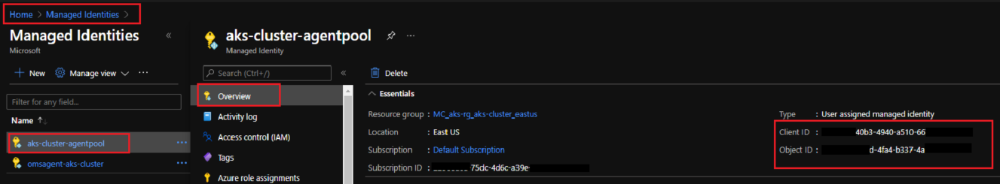
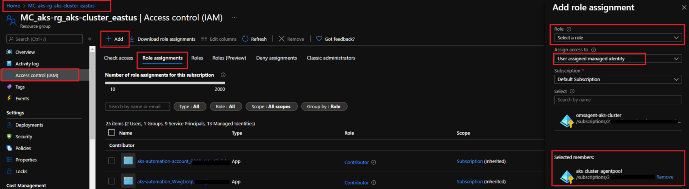
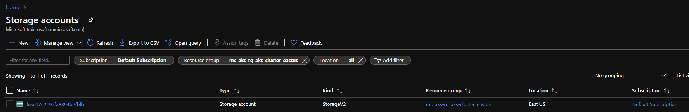
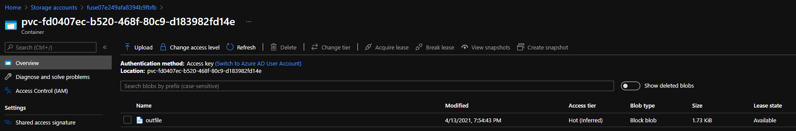
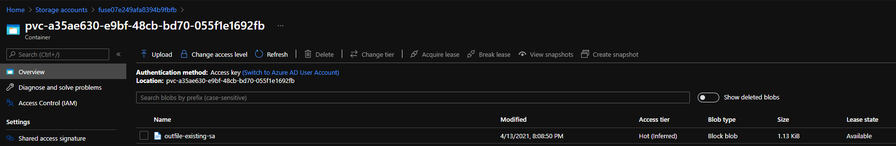

# Mounting Blob Storage on AKS


## Theory

Azure Blob can be mounted onto Pods running inside an AKS Cluster. There are mainly 2 drivers which are used for mounting Blobs onto Pods:

1. **Azure Blob Storage <u>CSI</u> Driver**: https://github.com/kubernetes-sigs/blob-csi-driver

2. **Blobfuse <u>FlexVolume</u> Driver** (<b> *Deprecated* </b>): https://github.com/Azure/kubernetes-volume-drivers/tree/master/flexvolume/blobfuse

   > Both the above drivers are out-of-tree volume plugins. However, there are certain limitations with the FlexVolume driver, and the the Kubernetes Storage SIG recommends using the CSI Volume Driver. More information about these can be found here: https://github.com/kubernetes/community/blob/master/sig-storage/volume-plugin-faq.md


**What are the limitations of FlexVolume?**

- FlexVolume requires root access on host machine to install FlexVolume driver files.
- FlexVolume drivers assume all volume mount dependencies, e.g. mount and filesystem tools, are available on the host OS. Installing these dependencies also require root access.

You can continue to use FlexVolume without worry of deprecation, but note that additional features (like topology, snapshots, etc.) will only be added to CSI.


In this document, we will primarily be talking about Blob Storage CSI Driver.

Blob CSI Driver allows Kubernetes to access Azure Storage through one of the following ways:

1. azure-storage-fuse: https://github.com/Azure/azure-storage-fuse
2. NFSv3 (still in preview): https://docs.microsoft.com/en-us/azure/storage/blobs/network-file-system-protocol-support

---


## Version Compatibility

https://github.com/kubernetes-sigs/blob-csi-driver#container-images--kubernetes-compatibility

### Container Images & Kubernetes Compatibility (as of writing this doc: Apr' 2021):

| driver version | Image                                      | supported k8s version | built-in blobfuse version |
| -------------- | ------------------------------------------ | --------------------- | ------------------------- |
| master branch  | mcr.microsoft.com/k8s/csi/blob-csi:latest  | 1.16+                 | 1.3.6                     |
| v1.0.0         | mcr.microsoft.com/k8s/csi/blob-csi:v1.0.0  | 1.16+                 | 1.3.6                     |
| v0.11.0        | mcr.microsoft.com/k8s/csi/blob-csi:v0.11.0 | 1.15+                 | 1.3.6                     |
| v0.10.0        | mcr.microsoft.com/k8s/csi/blob-csi:v0.10.0 | 1.15+                 | 1.3.5                     |


There are some important topics for Parameters, Pre-requisites, etc, for the CSI Driver, which can be looked upon in the following link: https://github.com/kubernetes-sigs/blob-csi-driver#driver-parameters

---


## Installation via *kubectl*:

### Installing an older version (0.10.0)

https://github.com/kubernetes-sigs/blob-csi-driver/blob/master/docs/install-csi-driver-v0.10.0.md

```bash
# rishabh@Azure:~$ curl -skSL https://raw.githubusercontent.com/kubernetes-sigs/blob-csi-driver/v0.10.0/deploy/install-driver.sh | bash -s v0.10.0 --
Installing Azure Blob Storage CSI driver, version: v0.10.0 ...
serviceaccount/csi-blob-controller-sa created
clusterrole.rbac.authorization.k8s.io/blob-external-provisioner-role created
clusterrolebinding.rbac.authorization.k8s.io/blob-csi-provisioner-binding created
clusterrole.rbac.authorization.k8s.io/blob-external-attacher-role created
clusterrole.rbac.authorization.k8s.io/blob-external-snapshotter-role created
clusterrolebinding.rbac.authorization.k8s.io/blob-csi-snapshotter-binding created
clusterrole.rbac.authorization.k8s.io/csi-blob-controller-secret-role created
clusterrolebinding.rbac.authorization.k8s.io/csi-blob-controller-secret-binding created
serviceaccount/csi-blob-node-sa created
clusterrole.rbac.authorization.k8s.io/csi-blob-node-secret-role created
clusterrolebinding.rbac.authorization.k8s.io/csi-blob-node-secret-binding created
Warning: storage.k8s.io/v1beta1 CSIDriver is deprecated in v1.19+, unavailable in v1.22+; use storage.k8s.io/v1 CSIDriver
csidriver.storage.k8s.io/blob.csi.azure.com created
deployment.apps/csi-blob-controller created
daemonset.apps/csi-blob-node created
Azure Blob Storage CSI driver installed successfully.
```

Have a look at the resources being created:

- ClusterRole and Bindings
- Service Accounts
- CSI Driver Storage resouce
- Deployments: blob-controller
- DaemonSet: blob-node

```bash
# rishabh@Azure:~$ kubectl get all -n kube-system | grep csi
NAME                                       READY   STATUS    RESTARTS   AGE
pod/csi-blob-controller-56887dc558-9zj7q   3/3     Running   0          3m31s
pod/csi-blob-controller-56887dc558-txhbr   3/3     Running   0          3m31s
pod/csi-blob-node-cll2x                    3/3     Running   0          3m28s
pod/csi-blob-node-cxh2b                    3/3     Running   0          3m28s
pod/csi-blob-node-z4c8q                    3/3     Running   0          3m28s
pod/csi-blob-node-z8kwz                    3/3     Running   0          3m28s

NAME                                      DESIRED   CURRENT   READY   UP-TO-DATE   AVAILABLE   NODE SELECTOR                 AGE
daemonset.apps/csi-blob-node              4         4         4       4            4           kubernetes.io/os=linux        3m29s

NAME                                  READY   UP-TO-DATE   AVAILABLE   AGE
deployment.apps/csi-blob-controller   2/2     2            2           3m33s

NAME                                             DESIRED   CURRENT   READY   AGE
replicaset.apps/csi-blob-controller-56887dc558   2         2         2       3m33s
```

### Uninstalling an older version

```bash
# rishabh@Azure:~$ curl -skSL https://raw.githubusercontent.com/kubernetes-sigs/blob-csi-driver/v0.10.0/deploy/uninstall-driver.sh | bash -s v0.10.0 --
Uninstalling Azure Blob Storage CSI driver, version: v0.10.0 ...
deployment.apps "csi-blob-controller" deleted
daemonset.apps "csi-blob-node" deleted
Warning: storage.k8s.io/v1beta1 CSIDriver is deprecated in v1.19+, unavailable in v1.22+; use storage.k8s.io/v1 CSIDriver
csidriver.storage.k8s.io "blob.csi.azure.com" deleted
serviceaccount "csi-blob-controller-sa" deleted
clusterrole.rbac.authorization.k8s.io "blob-external-provisioner-role" deleted
clusterrolebinding.rbac.authorization.k8s.io "blob-csi-provisioner-binding" deleted
clusterrole.rbac.authorization.k8s.io "blob-external-attacher-role" deleted
clusterrole.rbac.authorization.k8s.io "blob-external-snapshotter-role" deleted
clusterrolebinding.rbac.authorization.k8s.io "blob-csi-snapshotter-binding" deleted
clusterrole.rbac.authorization.k8s.io "csi-blob-controller-secret-role" deleted
clusterrolebinding.rbac.authorization.k8s.io "csi-blob-controller-secret-binding" deleted
serviceaccount "csi-blob-node-sa" deleted
clusterrole.rbac.authorization.k8s.io "csi-blob-node-secret-role" deleted
clusterrolebinding.rbac.authorization.k8s.io "csi-blob-node-secret-binding" deleted
Uninstalled Azure Blob Storage CSI driver successfully.

rishabh@Azure:~$ kubectl get all -n kube-system | grep csi
rishabh@Azure:~$

## No resource left.
```


If there are resources remaining in the cluster, which have not been removed properly, the individual resources from the above list can be removed manually using ```kubectl delete``` command.

### Installing latest version (master)

https://github.com/kubernetes-sigs/blob-csi-driver/blob/master/docs/install-csi-driver-master.md

```bash
# rishabh@Azure:~$ curl -skSL https://raw.githubusercontent.com/kubernetes-sigs/blob-csi-driver/master/deploy/install-driver.sh | bash -s master --
Installing Azure Blob Storage CSI driver, version: master ...
serviceaccount/csi-blob-controller-sa created
clusterrole.rbac.authorization.k8s.io/blob-external-provisioner-role created
clusterrolebinding.rbac.authorization.k8s.io/blob-csi-provisioner-binding created
clusterrole.rbac.authorization.k8s.io/blob-external-attacher-role created
clusterrole.rbac.authorization.k8s.io/blob-external-snapshotter-role created
clusterrolebinding.rbac.authorization.k8s.io/blob-csi-snapshotter-binding created
clusterrole.rbac.authorization.k8s.io/csi-blob-controller-secret-role created
clusterrolebinding.rbac.authorization.k8s.io/csi-blob-controller-secret-binding created
serviceaccount/csi-blob-node-sa created
clusterrole.rbac.authorization.k8s.io/csi-blob-node-secret-role created
clusterrolebinding.rbac.authorization.k8s.io/csi-blob-node-secret-binding created
Warning: storage.k8s.io/v1beta1 CSIDriver is deprecated in v1.19+, unavailable in v1.22+; use storage.k8s.io/v1 CSIDriver
csidriver.storage.k8s.io/blob.csi.azure.com created
deployment.apps/csi-blob-controller created
daemonset.apps/csi-blob-node created
Azure Blob Storage CSI driver installed successfully.


# rishabh@Azure:~$ kubectl get all -n kube-system | grep csi
pod/csi-blob-controller-ddb5567d4-7hglx    4/4     Running   0          42s
pod/csi-blob-controller-ddb5567d4-pwr6p    4/4     Running   0          42s
pod/csi-blob-node-5snbk                    3/3     Running   0          39s
pod/csi-blob-node-7rvjb                    3/3     Running   0          39s
pod/csi-blob-node-8kgnx                    3/3     Running   0          39s
pod/csi-blob-node-pp46r                    3/3     Running   0          39s

daemonset.apps/csi-blob-node              4         4         4       4            4           kubernetes.io/os=linux        39s

deployment.apps/csi-blob-controller   2/2     2            2           43s

replicaset.apps/csi-blob-controller-ddb5567d4    2         2         2       43s
```


#### To check the version installed

check the ```blob``` container's image in the csi-blob-controller Pod/Deployment:

```bash
# rishabh@Azure:~$ kubectl describe deploy -n kube-system csi-blob-controller
Name:                   csi-blob-controller
Namespace:              kube-system
...
...
   blob:                                                     ## Out of 4 containers in this Pod, check blob.
    Image:       mcr.microsoft.com/k8s/csi/blob-csi:latest   ## This is the version: latest
    Ports:       29632/TCP, 29634/TCP
...
...
```

---


## Usage

Now that we have installed the driver, we can use it to mount Blob Storage on Pods.

As with other Volume Mounts, we can provision the Volume in 2 ways:

1. Dynamic Provisioning
2. Static Provisioning

In Static Provisioning, the Volume Claims, refer to a Persistent Volume (PV) which contains data of the Blob Storage Account to mount.

>  Pod >> PVC >> PV (which is created manually)

In Dynamic Provisioning, a Persistent Volume (PV) is not present beforehand, and the Volume Claims refers to a Storage Class (SC) instead. The SC, when referred by a PVC, creates a Persistent Volume (in the backend).

> Pod >> PVC >> PV (which is automatically created by SC)

 

### Dynamic Provisioning: Creating new Storage Account using CSI Driver

#### Create Storage Class

```bash
# rishabh@Azure:~$ kubectl create -f https://raw.githubusercontent.com/kubernetes-sigs/blob-csi-driver/master/deploy/example/storageclass-blobfuse.yaml
storageclass.storage.k8s.io/blob created
```

```yaml
## Contents of the file:

apiVersion: storage.k8s.io/v1
kind: StorageClass
metadata:
  name: blob
provisioner: blob.csi.azure.com
parameters:
  skuName: Standard_LRS  # available values: Standard_LRS, Premium_LRS, Standard_GRS, Standard_RAGRS
reclaimPolicy: Retain  # if set as "Delete" container would be removed after pvc deletion
volumeBindingMode: Immediate
mountOptions:
  - -o allow_other
  - --file-cache-timeout-in-seconds=120
  - --use-attr-cache=true
  - -o attr_timeout=120
  - -o entry_timeout=120
  - -o negative_timeout=120
```

#### Create Persistent Volume Claim

```bash
# rishabh@Azure:~$ cat pvc.yaml
apiVersion: v1
kind: PersistentVolumeClaim
metadata:
  name: pvc-blob
spec:
  accessModes:
    - ReadWriteMany
  resources:
    requests:
      storage: 10Gi
  storageClassName: blob                        ## Referencing the same SC created above.
  
# rishabh@Azure:~$ kubectl apply -f pvc.yaml
persistentvolumeclaim/pvc-blob created


# rishabh@Azure:~$ kubectl describe pvc pvc-blob
Name:          pvc-blob
Namespace:     default
StorageClass:  blob
Status:        Pending
Volume:
Labels:        <none>
Annotations:   volume.beta.kubernetes.io/storage-provisioner: blob.csi.azure.com
Finalizers:    [kubernetes.io/pvc-protection]
Capacity:
Access Modes:
VolumeMode:    Filesystem
Used By:       <none>
Events:
  Type     Reason                Age                   From                                                                                       Message
  ----     ------                ----                  ----                                                                                       -------
  Normal   Provisioning          33s (x8 over 2m41s)   blob.csi.azure.com_aks-agentpool-20474252-vmss000000_d3994115-529e-4097-bcd3-04ff49e4fba4  External provisioner is provisioning volume for claim "default/pvc-blob"
  Warning  ProvisioningFailed    33s (x8 over 2m41s)   blob.csi.azure.com_aks-agentpool-20474252-vmss000000_d3994115-529e-4097-bcd3-04ff49e4fba4  failed to provision volume with StorageClass "blob": rpc error: code = Internal desc = failed to ensure storage account: could not list storage accounts for account type Standard_LRS: Retriable: false, RetryAfter: 0s, HTTPStatusCode: 403, RawError: Retriable: false, RetryAfter: 0s, HTTPStatusCode: 403, RawError: {"error":{"code":"AuthorizationFailed","message":"The client 'xxxxxx-9e5d-4fa4-b337-xxxxxx' with object id 'xxxxxx-4fa4-b337-4a37d4xxxxxx' does not have authorization to perform action 'Microsoft.Storage/storageAccounts/read' over scope '/subscriptions/xxxxxx-75dc-4d6c-a39e-xxxxxxxxxx/resourceGroups/mc_aks-rg_aks-cluster_eastus/providers/Microsoft.Storage' or the scope is invalid. If access was recently granted, please refresh your credentials."}}
  Normal   ExternalProvisioning  14s (x11 over 2m41s)  persistentvolume-controller                                                                waiting for a volume to be created, either by external provisioner "blob.csi.azure.com" ormanually created by system administrator
```

You may receive error as above. This is because the Identity associated with the cluster does not have permission over Microsoft.Storage. This is mentioned in the Pre-requisites: 

```
If cluster identity is Managed Service Identity(MSI), make sure user assigned identity has Contributor role on node resource group
```


Since my AKS Cluster is using Managed Identity, I need to provide the required permissions:



I can go to the Node Resource Group >> Access Control >> Add Role Assignment, and grant the required permissions:



After a while, we will notice the PVC to be in Bound state:

```bash
# rishabh@Azure:~$ kubectl describe pvc pvc-blob
Name:          pvc-blob
Namespace:     default
StorageClass:  blob
Status:        Bound
Volume:        pvc-fd0407ec-b520-468f-80c9-d183982fd14e
Labels:        <none>
Annotations:   pv.kubernetes.io/bind-completed: yes
               pv.kubernetes.io/bound-by-controller: yes
               volume.beta.kubernetes.io/storage-provisioner: blob.csi.azure.com
Finalizers:    [kubernetes.io/pvc-protection]
Capacity:      10Gi
Access Modes:  RWX
VolumeMode:    Filesystem
Used By:       <none>
Events:        <none>
```

We can see in the Portal, a new Storage Account is created:




#### Using the PVC in a Pod

Now that we have the SC and PVC created, we can create a Pod/Deployment to mount this PVC:

```bash
# rishabh@Azure:~$ cat pod.yaml
kind: Pod
apiVersion: v1
metadata:
  name: nginx-blob
spec:
  nodeSelector:
    "kubernetes.io/os": linux
  containers:
    - image: mcr.microsoft.com/oss/nginx/nginx:1.17.3-alpine
      name: nginx-blob
      command:
        - "/bin/sh"
        - "-c"
        - while true; do echo $(date) >> /mnt/blob/outfile; sleep 1; done
      volumeMounts:
        - name: blob01
          mountPath: "/mnt/blob"
  volumes:
    - name: blob01
      persistentVolumeClaim:
        claimName: pvc-blob                       ## This is where we mount the PVC created above.

# rishabh@Azure:~$ kubectl apply -f pod.yaml
pod/nginx-blob created
```

In the Portal, we can see that a file has been added to the Storage Account:



Let us clean the Pod, PVC and SC for other labs.

```bash
# rishabh@Azure:~$ kubectl delete -f pod.yaml
pod "nginx-blob" deleted

# rishabh@Azure:~$ kubectl delete -f pvc.yaml
persistentvolumeclaim "pvc-blob" deleted

# rishabh@Azure:~$ kubectl delete -f https://raw.githubusercontent.com/kubernetes-sigs/blob-csi-driver/master/deploy/example/storageclass-blobfuse.yaml
storageclass.storage.k8s.io "blob" deleted
```

---

### Dynamic Provisioning: Using an existing Storage Account

In this section, we will use an existing Storage Account instead of letting the CSI Driver create one. The Storage Account I will be using is the one which was created in the previous section by the CSI Driver.

#### Create a Secret using the Storage Account Name and the Key.

```bash
# rishabh@Azure:~$ kubectl create secret generic azure-secret --from-literal accountname=fuse07e249afa8394b9fbfb --from-literal accountkey="xxxxxxxxxxxxxxxxxxxxNS2uCAU/G3hUmQcdFtfB95C8jhfs1XUsskbaY6hyxxxxxxxxxxxxxxxx" --type=Opaque
secret/azure-secret created
```

#### Creating a Storage Class using the above Secret

```bash
# rishabh@Azure:~$ kubectl create -f https://raw.githubusercontent.com/kubernetes-sigs/blob-csi-driver/master/deploy/example/storageclass-blob-secret.yaml
storageclass.storage.k8s.io/blob created
```

```yaml
## Contents of the file:

apiVersion: storage.k8s.io/v1
kind: StorageClass
metadata:
  name: blob
provisioner: blob.csi.azure.com
parameters:
  csi.storage.k8s.io/provisioner-secret-name: azure-secret
  csi.storage.k8s.io/provisioner-secret-namespace: default
  csi.storage.k8s.io/node-stage-secret-name: azure-secret
  csi.storage.k8s.io/node-stage-secret-namespace: default
```

We can create a PVC and a Pod as done above:

#### Creating a PVC

```bash
# rishabh@Azure:~$ cat pvc.yaml
apiVersion: v1
kind: PersistentVolumeClaim
metadata:
  name: pvc-blob
spec:
  accessModes:
    - ReadWriteMany
  resources:
    requests:
      storage: 10Gi
  storageClassName: blob


# rishabh@Azure:~$ kubectl apply -f pvc.yaml
persistentvolumeclaim/pvc-blob created


# rishabh@Azure:~$ kubectl describe pvc pvc-blob
Name:          pvc-blob
Namespace:     default
StorageClass:  blob
Status:        Bound
Volume:        pvc-a35ae630-e9bf-48cb-bd70-055f1e1692fb
Labels:        <none>
Annotations:   pv.kubernetes.io/bind-completed: yes
               pv.kubernetes.io/bound-by-controller: yes
               volume.beta.kubernetes.io/storage-provisioner: blob.csi.azure.com
Finalizers:    [kubernetes.io/pvc-protection]
Capacity:      10Gi
Access Modes:  RWX
VolumeMode:    Filesystem
Used By:       <none>
Events:
  Type    Reason                 Age   From                                                                                       Message
  ----    ------                 ----  ----                                                                                       -------
  Normal  ExternalProvisioning   14s   persistentvolume-controller                                                                waiting for a volume to be created, either by external provisioner "blob.csi.azure.com" or manually created by system administrator
  Normal  Provisioning           14s   blob.csi.azure.com_aks-agentpool-20474252-vmss000000_d3994115-529e-4097-bcd3-04ff49e4fba4  External provisioner is provisioning volume for claim "default/pvc-blob"
  Normal  ProvisioningSucceeded  14s   blob.csi.azure.com_aks-agentpool-20474252-vmss000000_d3994115-529e-4097-bcd3-04ff49e4fba4  Successfully provisioned volume pvc-a35ae630-e9bf-48cb-bd70-055f1e1692fb
```

#### Creating a Pod to use the above created PVC

```bash
rishabh@Azure:~$ cat pod.yaml
kind: Pod
apiVersion: v1
metadata:
  name: nginx-blob
spec:
  nodeSelector:
    "kubernetes.io/os": linux
  containers:
    - image: mcr.microsoft.com/oss/nginx/nginx:1.17.3-alpine
      name: nginx-blob
      command:
        - "/bin/sh"
        - "-c"
        - while true; do echo $(date) >> /mnt/blob/outfile-existing-sa; sleep 1; done
      volumeMounts:
        - name: blob01
          mountPath: "/mnt/blob"
  volumes:
    - name: blob01
      persistentVolumeClaim:
        claimName: pvc-blob
rishabh@Azure:~$ kubectl apply -f pod.yaml
pod/nginx-blob created
```


We now have a new PVC, with new file being written into it:



Deleting the resources:

```bash
# rishabh@Azure:~$ kubectl delete -f pod.yaml
pod "nginx-blob" deleted


# rishabh@Azure:~$ kubectl delete -f pvc.yaml
persistentvolumeclaim "pvc-blob" deleted


# rishabh@Azure:~$ kubectl delete -f https://raw.githubusercontent.com/kubernetes-sigs/blob-csi-driver/master/deploy/example/storageclass-blob-secret.yaml
storageclass.storage.k8s.io "blob" deleted


# rishabh@Azure:~$ kubectl delete secret azure-secret
secret "azure-secret" deleted
```


Instead of creating a new PVC (for the SC) and a Pod to use the PVC, we could have directly created a Storage Class as shown here: https://raw.githubusercontent.com/kubernetes-sigs/blob-csi-driver/master/deploy/example/statefulset.yaml

---

